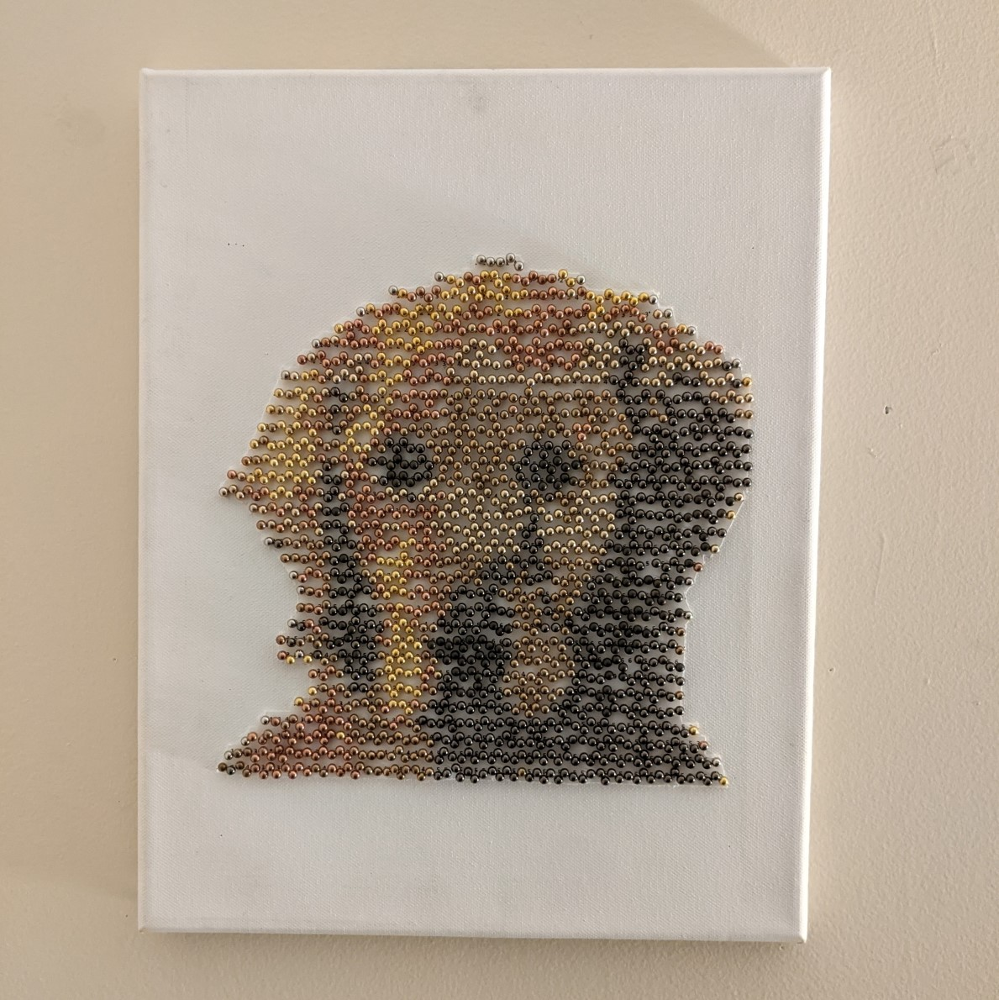

# What is this?

This is a program that I use to create pin art.

I take a photo, use this program to generate a map of numbers,
use that number map to poke pins into a canvas, and I end up with a finished
product that looks like the image below.



# How do I use it for myself?

## Required libraries

You'll need python installed, and python's package manager 'pip.'
The only library this program uses is Pillow (a fork of PIL).
To install, type
```
python3 -m pip install --upgrade pip
python3 -m pip install --upgrade Pillow
```
For help, visit: https://pillow.readthedocs.io/en/stable/installation.html

## To use

To use, download this repo, navigate to the folder in command line, and type
```
python Generator.py image_path [block size] [use unweighted algorithm?]
```

image_path: The path to the image file that you want to convert to pin art.

\[block size\] (optional): The size of each "pixel" or "block."  This will
depend on the resolution of the image you're using, but usually 20-40 is a good
number.  Think of it as "20x" or "40x smaller."

\[use unweighted algorithm?\] (optional): Since the human eye values certain colors more than others,
this program uses a weighted algorithm to determine which colors to map to which pixel
(or 'block').  To remove this bias, just add a "1" for this parameter.

## Program output

The program will output 2 images:

- "Number map.png"
  - This is a map of numbers showing you where to place pins.  Each number
  correlates to a color from Constants.py in the order that they appear.


- "Preview.png"
  - A preview of what the pin art will look like using the colors
provided in Constants.py.

The console output will tell you how many pins you'll need, and the
amount you need per color.
