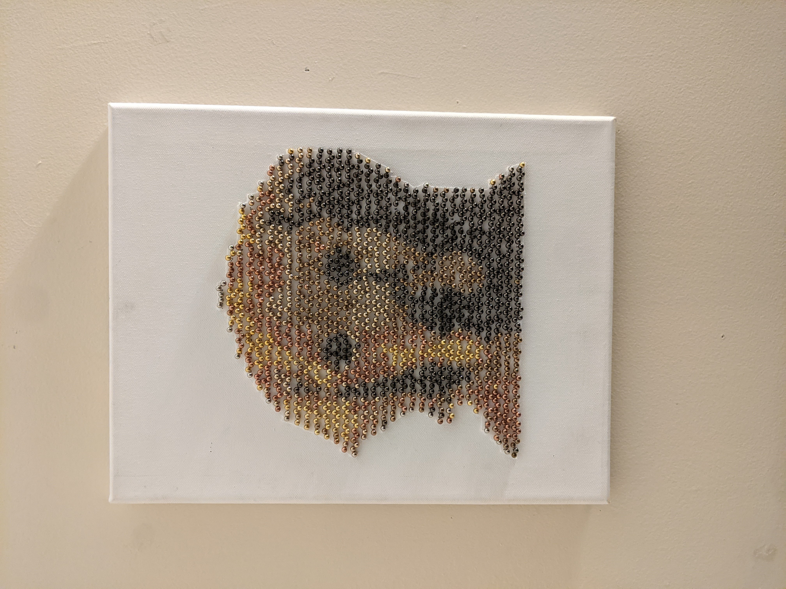

# What is this?

This is a program I use to create pin pin art

I take a photo, use this program to generate a map of numbers for me,
use that number map to poke pins into a canvas, and I end up with a finished
product that looks like the image below.



# How do I use it for myself?


## Required libraries

You'll need python installed, and python's package manager 'pip.'
The only library this program uses is Pillow (a fork of PIL.)
To install, type
```
python3 -m pip install --upgrade pip
python3 -m pip install --upgrade Pillow
```
For help, visit: https://pillow.readthedocs.io/en/stable/installation.html

## To use

To use, download this repo, navigate to the folder in command line, and type
```
python Generator.py image [block size] [use unweighted algorithm?]
```

image: The file you want to convert.

\[block size\] (optional): The size of each "pixel" or "block."  This will
depend on the resolution of the image you're using, but usually 20-40 is a good
number.  Think of it as "20x or 40x smaller."

use unweighted algorithm? (optional): By default this program uses a unweighted
algorithm to determine which colors to map to each pixel (or 'block').
Since the human eye values certain colors more than others, I favored the use of
some colors over others.  To remove this bias, just add a "1" for this
parameter.
